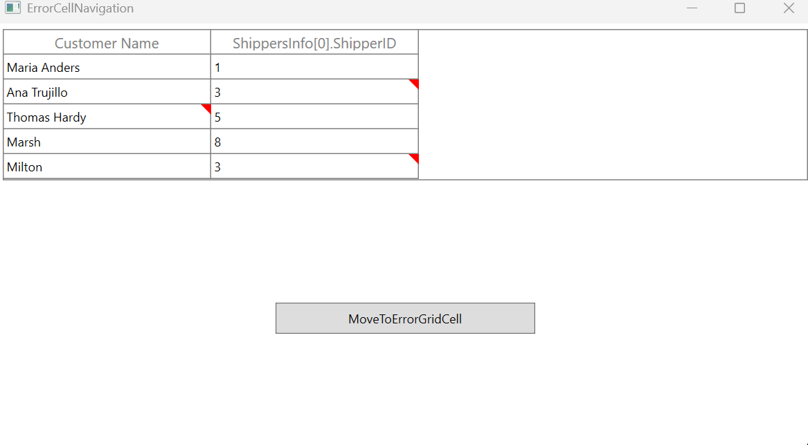

# How to navigate to the error cell based on a specific error in a WPF DataGrid?

In [WPF DataGrid](https://www.syncfusion.com/wpf-controls/datagrid) (SfDataGrid), navigation to a [GridCell](https://help.syncfusion.com/cr/wpf/Syncfusion.UI.Xaml.Grid.GridCell.html)  based on an specific error can be achieved by accessing the cell using the [ErrorMessage](https://help.syncfusion.com/cr/wpf/Syncfusion.UI.Xaml.Grid.GridCell.html#Syncfusion_UI_Xaml_Grid_GridCell_ErrorMessage) property of the GridCell.

Within the button click event, the GridCell is accessed by first retrieving the RowControl, then the CellsPanel, and subsequently the GridCell. From the retrieved GridCell check whether the GridCell contains the specific error message.

Based on this, the corresponding GridCell with the error can be identified. To move the focus to the GridCell on each button click, the **MoveCurrentCell** method can be used by passing the appropriate RowIndex and ColumnIndex.

```csharp
private void OnMoveToErrorGridCell(object sender, RoutedEventArgs e)
{
    var rowGenerator = dataGrid.RowGenerator;
    if(rowGenerator != null)
    {
        var rowItems = dataGrid.RowGenerator.Items;
        if (rowItems != null)
        {
            for (int i = rowIndex; i < rowItems.Count; i++)
            {
                var items = rowItems[i];
                if (items != null && items.Element != null && items.Element is HeaderRowControl)
                {
                    rowIndex++;
                    continue;
                }
                var rowControl = items.Element as VirtualizingCellsControl;
                if(rowControl != null && rowControl.Content != null)
                {
                    var orientedCellsPanel = rowControl.Content as OrientedCellsPanel;
                    if (orientedCellsPanel != null && orientedCellsPanel.Children != null)
                    {
                        foreach (var child in orientedCellsPanel.Children)
                        {
                            var gridCell = child as GridCell;
                            if (gridCell != null && gridCell.ErrorMessage != null && gridCell.ErrorMessage.Equals("Invalid shipper id"))
                            {
                                var errorGridCell = gridCell;
                                if (dataGrid.SelectionController != null)
                                    dataGrid.SelectionController.MoveCurrentCell(new RowColumnIndex(gridCell.ColumnBase.RowIndex, gridCell.ColumnBase.ColumnIndex));
                                rowIndex++;
                                return;
                            }
                        }
                        rowIndex++;
                    }
                }  
            }
        }
    }      
}
```



Take a moment to peruse the [WPF DataGrid - DataValidation](https://help.syncfusion.com/wpf/datagrid/data-validation) documentation, to learn more about data validation with examples.